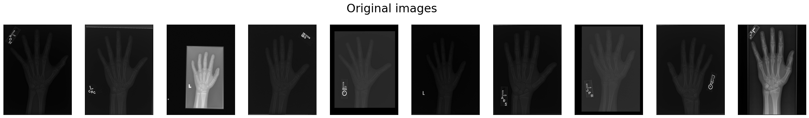
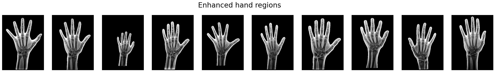

## Citation (TBD by 2025)
```
@article{mollineda2025sam,
  title={Sex classification from hand X-ray images in pediatric patients: how zero-shot Segment Anything Model (SAM) can improve medical image analysis},
  author={Ramón A. Mollineda, Becerra Karel, Mederos Boris},
  journal={Computers in Biology and Medicine},
  year={2025 TBD}
}
```
This work includes three primary steps: **Segmentaion, Classification, and Visualization**

# Datasets (available in [Kaggle](https://www.kaggle.com/datasets/karelbecerra/sam-x-ray-medical-images-hand-sex-classification/))


# Segmentation, Classification, Visualization
This work includes three primary steps: **Segmentaion, Classification, and Visualization**

## Segmentation
(documentaion in progress: how segmentaion works) 
First step is to apply segmentation (SAM) on x-ray hand images
Segmentation example outcome


## Classification
With different variations of segmented images we proceed to classification: 

### Training
(inprogress: description on how to training)

### Inference
(inprogress: description on how to run inference)

## Visualization
Finally applying CAMs the visualization of results

# Utils
Find Kaggle and Google Colab notebooks ready to vizualice datasets: check **kaggle** and **google-colab** folders

### Kaggle
Notebooks ready to run on Kaggle environment

### Google Colab
Notebooks ready to run on Google Colab environment